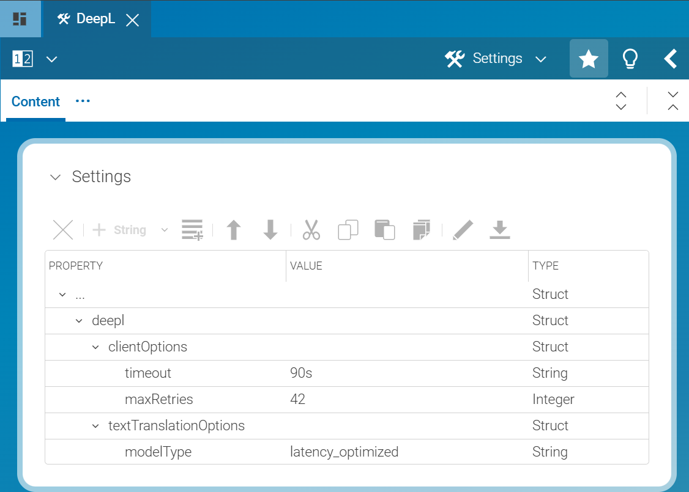

# CoreMedia DeepL Integration

This open-source extension allows to integrate DeepL for translation workflows in CoreMedia Content Cloud.


## Extension Dependencies
This extension has a dependency to the [coremedia-additional-workflows](https://github.com/CoreMedia/coremedia-additional-workflows) extension for the "create project" option.
Please make sure to also add the `coremedia-additional-workflows` extension to your workspace.

## Workspace Integration
This extension is provided as a CMCC [Project Extension](https://documentation.coremedia.com/cmcc-12/artifacts/2412.0/webhelp/coremedia-en/content/projectExtensions.html).

Add the extension to your workspace below modules/extensions, e.g. as a Git submodule or by copying the files into your workspace.
Afterward, enable the extension using the extension tool.

Furthermore, you'll need to add the shared module `deepl-config` to the `middle` extension as below.
It assumes the extension is located at `modules/extensions/deepl`.

Add the following module entry to `shared/middle/modules/extensions/pom.xml`:
```xml
<module>../../../../modules/extensions/deepl/shared/middle/deepl-config</module>
```
Add the module to the `pom.xml` of `middle-extensions-bom`:
```xml
<dependency>
  <groupId>com.coremedia.labs.translation.deepl</groupId>
  <artifactId>deepl-config</artifactId>
  <version>${project.version}</version>
</dependency>
```

## Workflow Registration
To register the workflow, add `translation-deepl.xml` to your workflow definitions in `global/management-tools/management-tools-image/src/main/image/coremedia/import-default-workflows`.

Add `TranslationDeepl:/com/coremedia/labs/translation/deepl/workflow/translation-deepl.xml` to the variable `DEFAULT_WORKFLOWS`.

In addition, you can also upload the workflow manually using the workflow cmd-line tool `cm upload`:
```shell
./cm upload -url http://content-management-server:40180/ior -f translation-deepl.xml
```

## Configuration

The DeepL integration can be configured using the following complementary approaches:
1. Using Spring application properties (and/or environment variables)
2. Using a Settings document linked to the master site's homepage

Configuration via 2. will override the (default) properties configured via 1.

### Configuration using Spring application properties
Please see the following classes for available configuration properties:
- [DeeplConfigurationProperties.java](shared/middle/deepl-config/src/main/java/com/coremedia/labs/translation/deepl/workflow/config/DeeplConfigurationProperties.java) / [DeeplConfiguration.java](shared/middle/deepl-config/src/main/java/com/coremedia/labs/translation/deepl/workflow/config/DeeplConfiguration.java)
- [DeepLClientOptions.java](https://github.com/DeepLcom/deepl-java/blob/914b84525edae2a3b08914e127c3db8604dd2ec8/deepl-java/src/main/java/com/deepl/api/DeepLClientOptions.java) and its parent class [TranslationOptions.java](https://github.com/DeepLcom/deepl-java/blob/914b84525edae2a3b08914e127c3db8604dd2ec8/deepl-java/src/main/java/com/deepl/api/TranslatorOptions.java)
- [TextTranslationOptions.java](https://github.com/DeepLcom/deepl-java/blob/914b84525edae2a3b08914e127c3db8604dd2ec8/deepl-java/src/main/java/com/deepl/api/TextTranslationOptions.java)

The only mandatory configuration is the DeepL API key (deep.api-key or DEEPL_API_KEY environment variable).

The configuration is primarily for the `workflow-server` component/container for translation purposes.
The API key can also be configured for the `studio-server` component to enable Studio validation of supported languages.

### Configuration using Settings

To configure the DeepL integration using content, create a Settings document named `DeepL` in `/Settings/Options/Settings/Translation Services` and link it to the _Linked Settings_ of the master site's homepage.

All settings need to be configured in a Struct property named `deepl`.

To configure DeepLClientOptions, create a Struct property named `clientOptions` and add the properties as key-value pairs.

To configure TextTranslationOptions, create a Struct property named `textTranslationOptions` and add the properties as key-value pairs.

Screenshot of example Settings:


